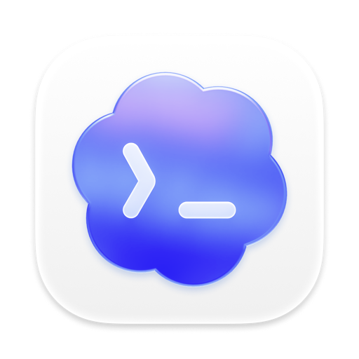

<div align="center">
  

  <h1>OpenAI Codex Desktop for Linux</h1>

  <p>
    <b>Native Linux packaging and release tooling for the official macOS Codex Desktop app.</b>
  </p>

  <p>
    <a href="https://github.com/mazixs/codex-desktop/actions/workflows/ci.yml"></a>
    <a href="https://github.com/mazixs/codex-desktop/releases/latest"></a>
    <a href="LICENSE"></a>
    
  </p>
</div>

---

## Overview

This repository adapts the official macOS Codex Desktop distribution to Linux by:

- downloading the upstream `Codex.dmg`
- extracting `app.asar`
- rebuilding macOS-native modules as Linux ELF binaries
- patching Linux-incompatible Electron code paths
- packaging a portable tarball, an Arch Linux package, and a Debian package

The project remains an unofficial port. The technical approach works, but it is inherently coupled to upstream bundle internals and should be treated as a maintained compatibility layer, not a stable public API.

## Current Status

✅ **What works today**

- tagged pipeline produces prebuilt portable, Arch, and Debian artifacts
- release notes are generated automatically from commit history between tags
- CI runs workflow linting, shell validation, portable packaging, Arch install/launch smoke tests, and Debian install/launch smoke tests on GitHub Actions
- the built-in file manager works on Linux and can open both file locations and individual files
- voice input works on Linux
- the current Linux build avoids the graphical glitches common in other unofficial Codex Desktop Linux solutions

⚠️ **Fragile by design**

- patching happens against a minified upstream `main.js` — upstream changes can break string-based patches without warning unless the guard checks catch them
- the runtime is Linux `x64` only at the moment

The detailed technical audit lives in [docs/REPOSITORY_AUDIT.md](docs/REPOSITORY_AUDIT.md).

## Install

Grab the format that fits your distro from the [latest release](https://github.com/mazixs/codex-desktop/releases/latest):

| Distro family        | Asset                                                                            | Install                                      |
| -------------------- | -------------------------------------------------------------------------------- | -------------------------------------------- |
| Arch / CachyOS       | `codex-desktop-native-<version>-archlinux-x86_64.pkg.tar.zst`                    | `sudo pacman -U <file>`                      |
| Debian / Ubuntu      | `codex-desktop-native-<version>-debian-amd64.deb`                                | `sudo dpkg -i <file>` (then `apt -f install`) |
| Any Linux x64 distro | `codex-desktop-native-<version>-linux-portable-x64.tar.gz`                       | extract and run `./start.sh`                 |

Every asset is accompanied by a `.sha256` checksum. Verify before installing:

```bash
sha256sum -c codex-desktop-native-<version>-<platform>.<ext>.sha256
```

## Local Build

### Prerequisites

- `node` 24+, `pnpm` (activated automatically through `corepack`)
- `python3`
- `7z` (from `p7zip-full`)
- `file`, `imagemagick`
- base toolchain (`build-essential` on Debian/Ubuntu, `base-devel` on Arch)

### Commands

```bash
git clone https://github.com/mazixs/codex-desktop.git
cd codex-desktop/codex-linux-build

pnpm install --frozen-lockfile
pnpm run build
./start.sh
```

To create the same portable artifact used in releases:

```bash
pnpm run package:portable
```

Artifacts are written to `codex-linux-build/artifacts/`.

From that portable artifact you can also build the distro-native packages locally:

```bash
# Arch
./scripts/build-arch-package.sh \
  --source codex-linux-build/artifacts/*.tar.gz \
  --metadata codex-linux-build/artifacts/build-metadata.env \
  --output-dir codex-linux-build/artifacts

# Debian / Ubuntu
./scripts/build-deb-package.sh \
  --source codex-linux-build/artifacts/*.tar.gz \
  --metadata codex-linux-build/artifacts/build-metadata.env \
  --output-dir codex-linux-build/artifacts
```

## Release Flow

The repository uses a tag-driven release process:

```bash
git tag v1.0.0
git push origin v1.0.0
```

After the tag is pushed, GitHub Actions:

1. builds the portable Linux archive `codex-desktop-native-<release-version>-linux-portable-x64.tar.gz`
2. in parallel, turns that archive into the Arch Linux package `codex-desktop-native-<release-version>-archlinux-x86_64.pkg.tar.zst`
3. in parallel, turns that archive into the Debian package `codex-desktop-native-<release-version>-debian-amd64.deb`
4. generates release notes from commit history since the previous tag
5. validates the asset contract (names, checksums, metadata, release notes)
6. creates or updates the GitHub Release and uploads every asset plus its `.sha256`

The CI/CD details live in [docs/CI_CD.md](docs/CI_CD.md).

## CI/CD Contract

The repository treats CI/CD as a product contract, not a best-effort build:

- Node is pinned to `24` in GitHub Actions
- `pnpm` is activated only through `corepack` using the version from `codex-linux-build/package.json`
- workflow syntax is linted with `actionlint`; shell scripts are linted with `shellcheck`
- the portable artifact must contain bundled Electron, Linux icons, packaged skill overrides, metadata, and a working launcher
- the Arch artifact must install through `pacman -U`, contain the bundled runtime under `/opt/codex-desktop`, and survive a headless `xvfb-run` smoke launch
- the Debian artifact must install through `dpkg -i`, contain the same runtime layout, and survive the same headless smoke launch
- releases publish only after the asset contract, checksums, metadata, and release notes all validate

Repo-controlled regressions fail with deterministic messages. External failures (GitHub outages, upstream DMG CDN issues, apt/pacman mirror errors) are treated as retriable infrastructure failures.

## Repository Layout

```
codex-desktop/
├── codex-linux-build/     build toolchain, launcher, portable packaging
│   ├── build.sh           orchestrates download → extract → rebuild → patch → package
│   ├── start.sh           portable launcher (GPU/Wayland flags, LSP bridge)
│   └── webview-server.js  local static host serving the frontend UI
├── scripts/               repository-level automation
│   ├── build-arch-package.sh
│   ├── build-deb-package.sh
│   ├── generate-release-notes.sh
│   ├── verify-portable-artifact.sh
│   ├── verify-arch-package.sh
│   ├── verify-deb-package.sh
│   └── verify-release-assets.sh
├── packaging/             distro-specific packaging assets
│   ├── arch/              PKGBUILD, wrapper, desktop entry
│   ├── aur/               AUR metadata
│   └── skills-overrides/  bundled skill overrides applied at build time
├── docs/                  architecture, reverse engineering notes, CI/CD documentation
├── .github/workflows/     CI and release pipelines
└── CLAUDE.md              guidance for Claude Code agents working in this repo
```

## Documentation

- [docs/ARCHITECTURE.md](docs/ARCHITECTURE.md) — patches, native rebuilds, webview proxy, LSP bridge
- [docs/TECHNICAL_DETAILS.md](docs/TECHNICAL_DETAILS.md) — deeper reverse-engineering notes
- [docs/REPOSITORY_AUDIT.md](docs/REPOSITORY_AUDIT.md) — technical audit of fragility surface
- [docs/CI_CD.md](docs/CI_CD.md) — pipeline contract, versioning strategy, artifact contract

## Limitations

- The upstream application is distributed for macOS, so Linux compatibility depends on reverse-engineered patch points.
- This repository does not publish an official upstream build; it automates a local adaptation.
- If upstream Electron internals, native module versions, or bundle structure change, the Linux build may need patch updates.
- Only `linux-x64` is supported today. `aarch64` is not in scope yet.

## License

Repository code is provided under [Apache-2.0](LICENSE). Upstream Codex application binaries remain subject to OpenAI's terms.
