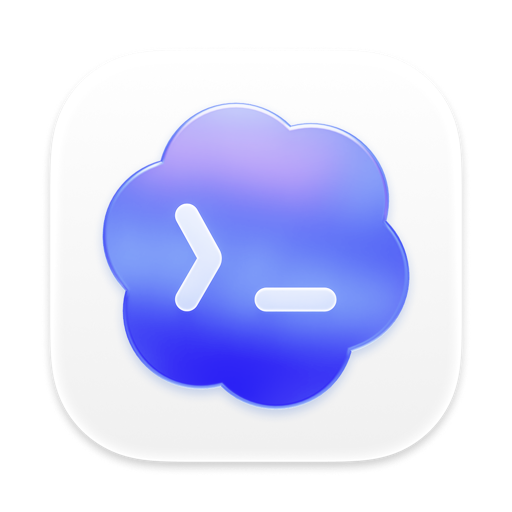

<div align="center">
  

  <h1>OpenAI Codex Desktop for Linux</h1>

  <p>
    <b>A ready-to-install Linux desktop build of the official Codex Desktop app, with Linux-native runtime packaging and compositor-safe UI patches.</b>
  </p>

  <p>
    <a href="https://github.com/mazixs/codex-desktop/actions/workflows/ci.yml"></a>
    <a href="https://github.com/mazixs/codex-desktop/releases/latest"></a>
    <a href="LICENSE"></a>
    
  </p>
</div>

---

## Overview

This repository ships a prebuilt Linux distribution of Codex Desktop. It is not just a patch collection or a helper script that asks you to repair the macOS app locally: release assets contain the upstream Codex Desktop bundle, a Linux Electron runtime, rebuilt native modules, the Linux Codex CLI, desktop integration files, and the patch layer needed for the app to behave like a normal Linux desktop application.

The current main-branch baseline is:

- upstream Codex Desktop: `26.602.40724`
- Linux Codex CLI: `@openai/codex 0.137.0`
- Electron runtime: `42.1.0`

Each release preserves the exact upstream version in `build-metadata.env`, so installed packages and release artifacts can be traced back to the DMG they were built from.

The supported runtime is now the product-style Electron layout. Release and local package artifacts launch a renamed Electron binary (`codex-desktop`) against `resources/app.asar`, so Electron reports `app.isPackaged=true` and uses the same code paths as the upstream desktop product. The old unpacked `electron dist/` flow is kept only as a development fallback for patch iteration. It is not a reliable plugin or skills validation target because dev/unpacked builds can expose unstable states, development plugin catalogs, and test plugin versions that do not match the packaged product.

Under the hood, the build pipeline adapts the official macOS Codex Desktop distribution by:

- downloading the upstream `Codex.dmg`
- extracting `app.asar`
- rebuilding macOS-native modules as Linux ELF binaries
- patching Linux-incompatible Electron code paths
- packaging a portable tarball, an Arch Linux package, and a Debian package

The project remains an unofficial port. The important difference is the deliverable: users download and install a complete Linux app, while maintainers keep the upstream refresh, native rebuild, patching, packaging, and CI smoke tests inside this repository.

## Why This Build

Codex Desktop currently ships upstream as a macOS desktop application. This project turns that upstream app into Linux release artifacts that are practical to consume:

- **Ready-to-install artifacts**: portable archive, Arch package, and Debian package are built from the same checked artifact contract.
- **Bundled runtime**: the app includes the Electron runtime, Linux-native native modules, launcher, icons, packaged skill overrides, and metadata.
- **Product Electron mode**: releases run from `resources/app.asar` with `app.isPackaged=true`, not from the unpacked developer `dist/` app.
- **Upstream included**: the official Codex Desktop app bundle is downloaded during the build and carried into the release artifact with version metadata.
- **Linux-first UX fixes**: transparency, theme, menu, file-manager, editor-detection, voice-input, and skills-path issues are patched before packaging.
- **CI-backed releases**: GitHub Actions validates workflows, packages the app, installs the distro packages, and smoke-launches them under `xvfb`.

## Linux Adaptation Highlights

The Linux patch layer focuses on making the app feel native and predictable after installation:

- **Opaque Linux windows**: upstream transparent, vibrancy, Mica, and visual-effect settings are disabled for Linux. This prevents invisible or washed-out windows on Linux compositors.
- **Working light and dark themes**: Linux uses explicit opaque backgrounds for both themes, including the left sidebar, so the light theme no longer becomes dim or low-contrast.
- **Working in-app application menu**: the upstream File/Edit/View/Window/Help `ApplicationMenu` stays alive for the app's own menu buttons and accelerators, while the duplicate native Electron window menubar is hidden on Linux.
- **Linux file manager support**: file and folder actions use `xdg-open` / Electron `shell.openPath`, and individual file paths open their parent directory correctly.
- **Project opening from Linux editors**: the app can offer installed Linux tools such as VS Code, VS Code Insiders, Cursor, Windsurf, Zed, Sublime Text, Android Studio, and JetBrains IDEs when opening a project.
- **Codex backend on Linux**: the packaged launcher wires the Electron frontend to the Linux `@openai/codex` CLI instead of the macOS-only upstream backend binary.
- **Packaged skills layout**: bundled skill overrides are copied into the Linux artifact and resolved from packaged paths, so the app can find them after installation.
- **Stable bundled plugin runtime**: Browser Use and other Linux-supported bundled plugins are loaded from product `resources/plugins` with packaged `codex`, `node`, and `node_repl` resources. The launcher ignores stale inherited `CODEX_*` runtime paths by default so an older installed app cannot poison the active plugin runtime.
- **Voice input**: the Linux build preserves the upstream voice-input path and verifies that it launches in the packaged app.
- **Phone-based control (Computer Use)**: the phone-based remote control feature (Computer Use) is fully functional on Linux, matching the native macOS experience.

## Current Status

✅ **What works today**

- tagged pipeline produces prebuilt portable, Arch, and Debian artifacts
- release notes are generated automatically from commit history between tags
- CI runs workflow linting, shell validation, portable packaging, Arch install/launch smoke tests, and Debian install/launch smoke tests on GitHub Actions
- the built-in file manager works on Linux and can open both file locations and individual files
- Browser Use bundled plugin resources are packaged and smoke-tested from product `resources/`; Chrome is included in the marketplace only when the upstream bundle contains a Linux `extension-host`
- common Linux editors and IDEs are offered for opening projects when their CLIs are installed
- light and dark themes are both adapted for opaque Linux rendering
- voice input works on Linux
- phone-based control (Computer Use) works on Linux, matching the macOS behavior
- the Linux build keeps the upstream application menu functional for in-app File/Edit/View/Window/Help buttons without showing a duplicate Electron menubar
- the current Linux build avoids the transparent-window and washed-out-theme glitches common in rough macOS-to-Linux ports
- the in-app Browser plugin is the supported browser-control path on Linux; the external Chrome plugin needs an upstream Linux native messaging host before it can be auto-installed

⚠️ **Fragile by design**

- patching happens against a minified upstream `main.js` — upstream changes can break string-based patches without warning unless the guard checks catch them
- the runtime is Linux `x64` only at the moment

The detailed technical audit lives in [docs/REPOSITORY_AUDIT.md](docs/REPOSITORY_AUDIT.md).

## Install

Grab the format that fits your distro from the [latest release](https://github.com/mazixs/codex-desktop/releases/latest):

| Distro family        | Asset                                                                            | Install                                      |
| -------------------- | -------------------------------------------------------------------------------- | -------------------------------------------- |
| Arch / CachyOS       | `codex-desktop-native-<version>-archlinux-x86_64.pkg.tar.zst`                    | `sudo pacman -U <file>`                      |
| Debian / Ubuntu      | `codex-desktop-native-<version>-debian-amd64.deb`                                | `sudo dpkg -i <file>` (then `apt -f install`) |
| Any Linux x64 distro | `codex-desktop-native-<version>-linux-portable-x64.tar.gz`                       | extract and run `./start.sh`                 |

Every asset is accompanied by a `.sha256` checksum. Verify before installing:

```bash
sha256sum -c codex-desktop-native-<version>-<platform>.<ext>.sha256
```

The release assets are the intended user-facing product. You should not need to download a DMG, run patch scripts manually, or assemble Electron pieces yourself. For plugin behavior, use the released package or portable product artifact; the unpacked developer launcher is not representative.

## Local Build

### Prerequisites

- `node` 24+, `pnpm` (activated automatically through `corepack`)
- `python3`
- `7z` (from `p7zip-full`)
- `file`, `imagemagick`
- base toolchain (`build-essential` on Debian/Ubuntu, `base-devel` on Arch)

### Commands

```bash
git clone https://github.com/mazixs/codex-desktop.git
cd codex-desktop/codex-linux-build

pnpm install --frozen-lockfile
pnpm run package:portable
```

Artifacts are written to `codex-linux-build/artifacts/`. To smoke-test the product runtime locally, extract the portable archive and launch its `start.sh`:

```bash
mkdir -p /tmp/codex-desktop-product
tar -xzf artifacts/codex-desktop-native-*-linux-portable-x64.tar.gz -C /tmp/codex-desktop-product
/tmp/codex-desktop-product/codex-desktop-native-*-linux-portable-x64/start.sh
```

`pnpm run build` still exists for fast patch iteration against the unpacked `dist/` tree. Do not use `pnpm run build && ./start.sh` as final validation for Browser Use, Chrome, bundled plugins, or skills: that path runs Electron with `app.isPackaged=false`, starts `webview-server.js`, and may load dev/test plugin state that differs from the product app.

From that portable artifact you can also build the distro-native packages locally:

```bash
cd ..

# Arch
./scripts/build-arch-package.sh \
  --source codex-linux-build/artifacts/*.tar.gz \
  --metadata codex-linux-build/artifacts/build-metadata.env \
  --output-dir codex-linux-build/artifacts

# Debian / Ubuntu
./scripts/build-deb-package.sh \
  --source codex-linux-build/artifacts/*.tar.gz \
  --metadata codex-linux-build/artifacts/build-metadata.env \
  --output-dir codex-linux-build/artifacts
```

## Release Flow

The repository uses a tag-driven release process:

```bash
git tag v1.0.0
git push origin v1.0.0
```

After the tag is pushed, GitHub Actions:

1. builds the portable Linux archive `codex-desktop-native-<release-version>-linux-portable-x64.tar.gz`
2. in parallel, turns that archive into the Arch Linux package `codex-desktop-native-<release-version>-archlinux-x86_64.pkg.tar.zst`
3. in parallel, turns that archive into the Debian package `codex-desktop-native-<release-version>-debian-amd64.deb`
4. generates release notes from commit history since the previous tag
5. validates the asset contract (names, checksums, metadata, release notes)
6. creates or updates the GitHub Release and uploads every asset plus its `.sha256`

Release notes are also where the current upstream Codex Desktop version and Linux packaging changes are surfaced for users. In practice, each release answers two questions: which upstream app was packaged, and what Linux adaptation changed in this build.

The CI/CD details live in [docs/CI_CD.md](docs/CI_CD.md).

## CI/CD Contract

The repository treats CI/CD as a product contract, not a best-effort build:

- Node is pinned to `24` in GitHub Actions
- `pnpm` is activated only through `corepack` using the version from `codex-linux-build/package.json`
- workflow syntax is linted with `actionlint`; shell scripts are linted with `shellcheck`
- the portable artifact must contain bundled Electron, `resources/app.asar`, `app.asar.unpacked`, product plugin resources, `resources/codex`, Linux icons, packaged skill overrides, metadata, and a working launcher
- the Arch artifact must install through `pacman -U`, contain the bundled product runtime under `/opt/codex-desktop`, and survive a headless `xvfb-run` smoke launch
- the Debian artifact must install through `dpkg -i`, contain the same product runtime layout, and survive the same headless smoke launch
- launch smoke tests must report `packaged=true`, avoid React devtools, prove Browser Use selects the product `resources/node_repl` instead of stale inherited `CODEX_*` paths, and fail on bundled plugin reconcile errors
- releases publish only after the asset contract, checksums, metadata, and release notes all validate

Repo-controlled regressions fail with deterministic messages. External failures (GitHub outages, upstream DMG CDN issues, apt/pacman mirror errors) are treated as retriable infrastructure failures.

## Repository Layout

```
codex-desktop/
├── codex-linux-build/     build toolchain, launcher, portable packaging
│   ├── build.sh           orchestrates download → extract → rebuild → patch → package
│   ├── start.sh           portable launcher (product app.asar mode, GPU/Wayland flags)
│   └── webview-server.js  local static host used only by the unpacked dev fallback
├── scripts/               repository-level automation
│   ├── build-arch-package.sh
│   ├── build-deb-package.sh
│   ├── generate-release-notes.sh
│   ├── verify-portable-artifact.sh
│   ├── verify-arch-package.sh
│   ├── verify-deb-package.sh
│   └── verify-release-assets.sh
├── packaging/             distro-specific packaging assets
│   ├── arch/              PKGBUILD, wrapper, desktop entry
│   ├── aur/               AUR metadata
│   └── skills-overrides/  bundled skill overrides applied at build time
├── docs/                  architecture, reverse engineering notes, CI/CD documentation
├── .github/workflows/     CI and release pipelines
└── CLAUDE.md              guidance for Claude Code agents working in this repo
```

## Documentation

- [docs/ARCHITECTURE.md](docs/ARCHITECTURE.md) — patches, native rebuilds, webview proxy, LSP bridge
- [docs/TECHNICAL_DETAILS.md](docs/TECHNICAL_DETAILS.md) — deeper reverse-engineering notes
- [docs/REPOSITORY_AUDIT.md](docs/REPOSITORY_AUDIT.md) — technical audit of fragility surface
- [docs/CI_CD.md](docs/CI_CD.md) — pipeline contract, versioning strategy, artifact contract
- [docs/MAINTENANCE_HISTORY.md](docs/MAINTENANCE_HISTORY.md) — recent upstream DMG / patch maintenance timeline

## Limitations

- The upstream application is distributed for macOS, so Linux compatibility depends on reverse-engineered patch points.
- This repository does not publish an official upstream build; it automates a local adaptation.
- If upstream Electron internals, native module versions, or bundle structure change, the Linux build may need patch updates.
- Only `linux-x64` is supported today. `aarch64` is not in scope yet.

## License

Repository code is provided under [Apache-2.0](LICENSE). Upstream Codex application binaries remain subject to OpenAI's terms.
